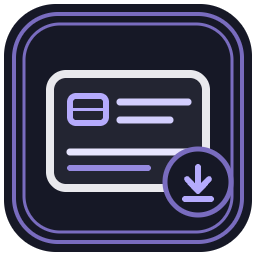
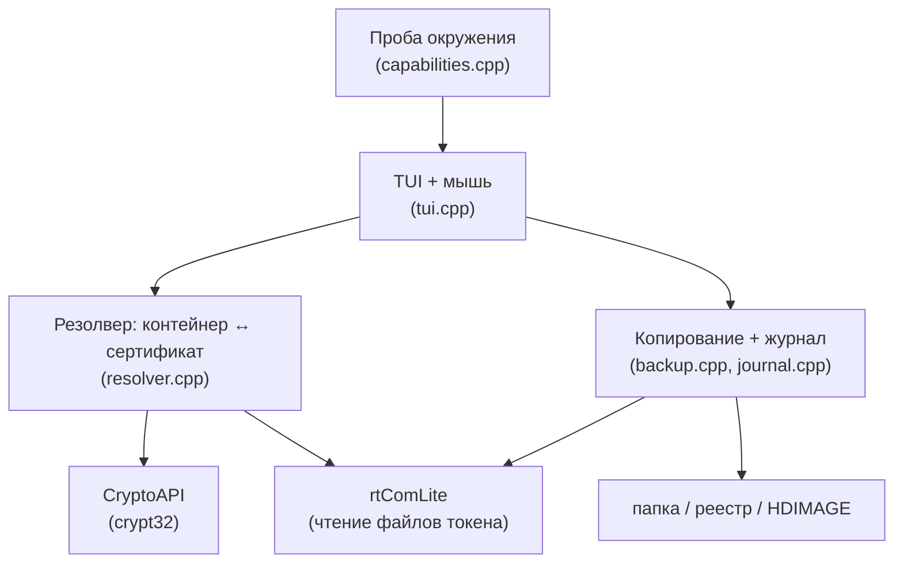

<div align="center">



# CertBuckUp

**Резервное копирование и миграция ключевых контейнеров КриптоПро —
с человекочитаемым выбором контейнера.**

[](https://github.com/iMironRU/certbuckup/actions/workflows/build.yml)
[](LICENSE)


</div>

---

Штатные инструменты показывают контейнеры обезличенным GUID
(`he-8f3a1c2d.000`) и заставляют угадывать, чей это ключ. **CertBuckUp
резолвит связь `контейнер → сертификат` и показывает владельца, ИНН и срок
действия** — чтобы оператор при резервировании десятков КЭП видел, что́ он
копирует, а не тыкался вслепую.

Главная задача — **резервное копирование** ключевых контейнеров: снять копию
до переустановки системы, замены токена, истечения срока; собрать архив парка
КЭП организации.

```text
╔═ Токены › Rutoken Lite ══════════════════════════════════════════════╗
║                                                                      ║
║   ▤ ООО «Ромашка»                              ключ неэкспортируемый ║
║     ИНН 7701234567 · до 2027-07-15 · A1B2C3D4                        ║
║                                                                      ║
║   ▤ ООО «Ромашка»                              ключ неэкспортируемый ║
║     ИНН 7701234567 · до 2026-04-16 · E5F6A7B8                        ║
║                                                                      ║
║   ▤ ИП Иванов И.И.                             ключ неэкспортируемый ║
║     ИНН 7701987654 · до 2027-01-24 · C9D0E1F2                        ║
║                                                                      ║
╚══════════════════════════════════════════════════════════════════════╝
  ↑↓/колесо   F5 или 2×клик — копировать   F3 инфо   Esc назад   F10 выход
```

## Возможности

- **Инвентаризация с резолвом сертификата** — владелец (юрлицо/ИП), ИНН,
  срок действия с подсветкой истекающих, носитель, отпечаток, тип ключа.
- **Резервное копирование** файлового контейнера в четыре назначения:
  - папка рядом с приложением (архив `ИНН.ММГГ`),
  - диск (например `D:`),
  - реестр Windows,
  - папка КриптоПро (HDIMAGE) — сразу видна самому КриптоПро.
- **Определение аппаратных ключей** (крипта внутри чипа) и исключение их из
  копирования заранее — оператор не тратит время на некопируемое.
- **Журнал операций** (append-only): что, когда, откуда, куда, отпечаток.
- **TUI с мышью** — навигация, копирование двойным кликом, тёмная тема.
- **Один статический `.exe`** без зависимостей — работает на Windows 7 и выше,
  на целевые машины ставить нечего.

## Границы возможного

Инструмент работает **только с файловыми контейнерами** (в т.ч. на токене в
режиме FKC). Это граница физики, а не реализации:

| Носитель / режим | Копирование |
|---|---|
| Реестр, файловый контейнер на токене (Рутокен Lite, FKC) | да |
| Ключ, сгенерированный **внутри** чипа (крипта на токене) | **невозможно** — блоба для переноса нет |

Зависимость от **КриптоПро CSP** для чтения контейнеров неустранима.

## Интерфейс

Запуск без параметров открывает интерфейс:

```
CertBuckUp.exe
```

| Клавиша / мышь | Действие |
|---|---|
| `↑↓` / колесо | навигация по списку |
| `Enter` / клик | открыть токен |
| `F5` / двойной клик | копировать сертификат |
| `F3` | информация о контейнере |
| `F10` | выход |

Текстовый режим и служебные команды: `--list`, `--env`, `--scan`,
`--backup N`, `--help`.

## Архитектура



Резолвер и ядро копирования не зависят от UI. Подробнее об устройстве
контейнера — `docs/container-format.md`.

## Сборка

Windows-only, 32-битный статический бинарь (запускается и на x86, и на x64
Windows 7+). Тулчейн — MinGW-w64 **i686, MSVCRT** (не UCRT — её нет на
стоковой Win7).

```powershell
# положить тулчейн в %LOCALAPPDATA%\mingw32 (WinLibs i686 MSVCRT) или задать
# $env:MINGW32_BIN, затем:
.\build.ps1
```

`build.ps1` находит тулчейн и вызывает `make`. Иконка подхватывается из
`assets/app.ico`. Результат — `build/CertBuckUp.exe`, зависит только от
системных DLL (kernel32, advapi32, crypt32, msvcrt, …).

## Безопасность

Инструмент копирования ключей в чужих руках — механизм кражи подписи. Поэтому
в ядро встроены сдерживающие механизмы: **журнал операций** (append-only),
подтверждение перезаписи, отсутствие автоматического «скопировать всё подряд».
Пользуйтесь только на своём парке КЭП.

## Дорожная карта

Запись на токен, копирование токен → токен, снятие признака на CSP 5.x,
перепривязка сертификата — см. [BACKLOG.md](BACKLOG.md).

## Лицензия

[GNU GPL v3](LICENSE).
