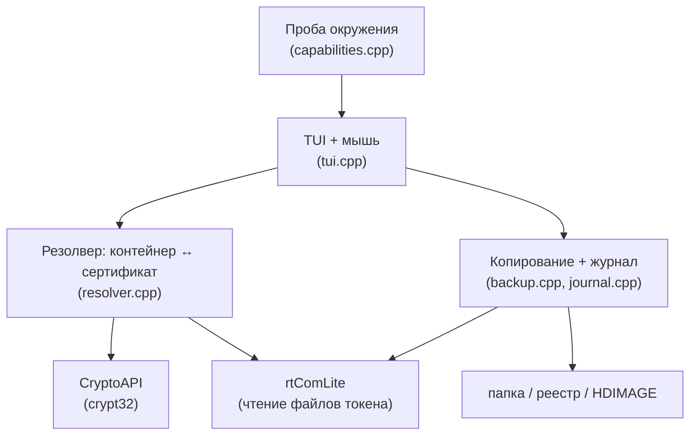

# CertBuckUp — подробное руководство

Титульный обзор — в [README](../README.md). Здесь детали.

## Возможности

- **Инвентаризация с резолвом сертификата** — владелец (юрлицо/ИП), ИНН,
  срок действия с подсветкой истекающих, носитель, отпечаток, тип ключа.
- **Резервное копирование** файлового контейнера в четыре назначения:
  - папка рядом с приложением (архив `ИНН.ММГГ`),
  - диск (например `D:`),
  - реестр Windows,
  - папка КриптоПро (HDIMAGE) — сразу видна самому КриптоПро.
- **Читаемое имя контейнера** вместо GUID: при копировании `name.key`
  получает имя вида `Организация ИНН до ММ.ГГГГ`. Отдельно — переименование
  существующих контейнеров на месте (реестр, папка КриптоПро), клавиша `F6`.
- **Определение аппаратных ключей** (крипта внутри чипа) и исключение их из
  копирования заранее — оператор не тратит время на некопируемое.
- **Журнал операций** (append-only): что, когда, откуда, куда, отпечаток.
- **Проба окружения** при запуске: что установлено, чего не хватает и где
  скачать; предложение установить rtComLite при отсутствии.
- **TUI с мышью** — навигация, копирование двойным кликом, тёмная тема.
- **Один статический `.exe`** без зависимостей — Windows 7 и выше, на целевые
  машины ставить нечего.

## Границы возможного

Инструмент работает **только с файловыми контейнерами** (в т.ч. на токене в
режиме FKC). Это граница физики, а не реализации:

| Носитель / режим | Копирование |
|---|---|
| Реестр, файловый контейнер на токене (Рутокен Lite, FKC) | да |
| Ключ, сгенерированный **внутри** чипа (крипта на токене) | **невозможно** — блоба для переноса нет |

Зависимость от **КриптоПро CSP** для чтения контейнеров неустранима.

## Интерфейс

| Клавиша / мышь | Действие |
|---|---|
| `↑↓` / колесо | навигация по списку |
| `Enter` / клик | открыть токен |
| `F5` / двойной клик | копировать сертификат |
| `F6` | переименовать контейнер (реестр / папка КриптоПро) |
| `F3` | информация о контейнере |
| `F10` | выход |

Служебные команды: `--list [-v]`, `--env`, `--scan`, `--backup N`,
`--backup-reg N`, `--backup-cp N`, `--rename N`, `--help`.

## Архитектура



Резолвер и ядро копирования не зависят от UI. Устройство контейнера —
[container-format.md](container-format.md).

## Сборка

Windows-only, 32-битный статический бинарь (запускается и на x86, и на x64
Windows 7+). Тулчейн — MinGW-w64 **i686, MSVCRT** (не UCRT — её нет на
стоковой Win7).

```powershell
# положить тулчейн в %LOCALAPPDATA%\mingw32 (WinLibs i686 MSVCRT) или задать
# $env:MINGW32_BIN, затем:
.\build.ps1
```

`build.ps1` находит тулчейн и вызывает `make`. Иконка подхватывается из
`assets/app.ico`. Результат — `build/CertBuckUp.exe`, зависит только от
системных DLL (kernel32, advapi32, crypt32, msvcrt, …). CI собирает то же на
чистом раннере (`.github/workflows/build.yml`).

## Безопасность

Инструмент копирования ключей в чужих руках — механизм кражи подписи. Поэтому
в ядро встроены сдерживающие механизмы: **журнал операций** (append-only),
подтверждение перезаписи, отсутствие автоматического «скопировать всё подряд».
Пользуйтесь только на своём парке КЭП.
